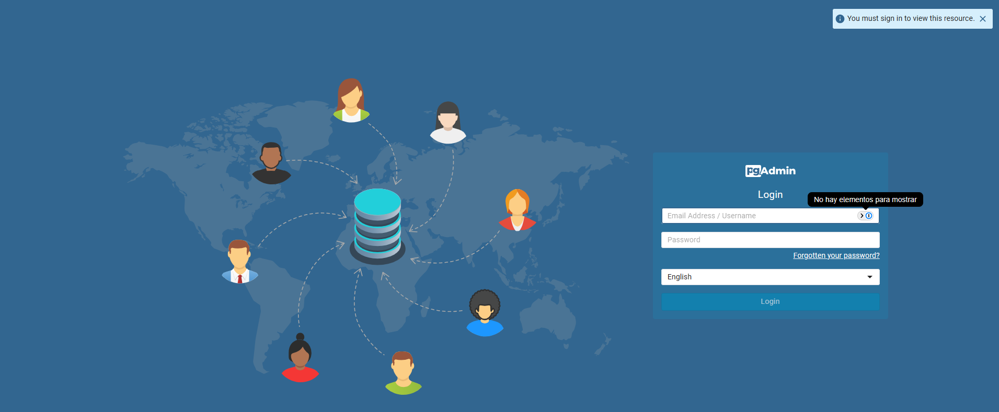
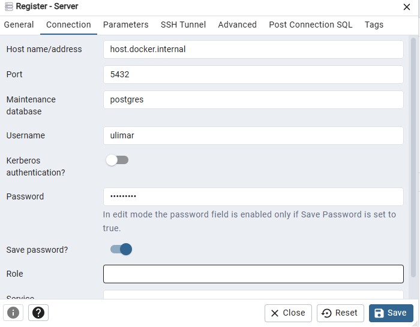
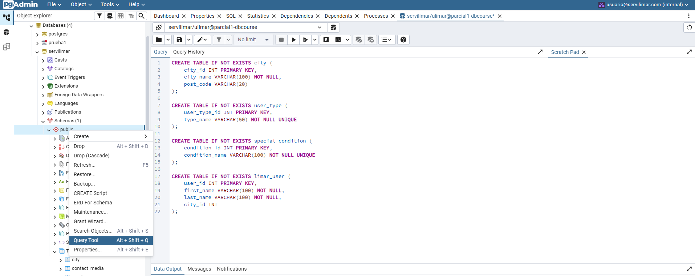

# Sistema de Turnos - Servicios LiMar (Base de Datos - Parcial 1)

Este repositorio contiene los artefactos para el despliegue y configuración de la base de datos para el sistema de generación de turnos de Servicios LiMar, como parte de la evaluación práctica del curso de Bases de Datos (750006C).

Escuela de Ingeniería en Sistemas y Computación
Universidad del Valle, 2025

**Autor:** David Esteban Valencia Valencia (2415092)

## Prerrequisitos

Para levantar el entorno y configurar la base de datos, es necesario tener instalado lo siguiente:
*   [Docker](https://www.docker.com/products/docker-desktop/)
*   Un cliente de Git para clonar el repositorio.

## Instrucciones de Despliegue y Configuración

Siga los siguientes pasos para levantar los contenedores y configurar la base de datos.

### 1. Clonar el Repositorio

Abra una terminal y clone este repositorio en su máquina local:
```bash
git clone https://github.com/Devv1507/dbcourse-servilimar.git
cd dbcourse-servilimar
```

### 2. Levantar los Contenedores

Ejecute los siguientes comandos en la terminal para desplegar los contenedores de PostgreSQL y pgAdmin.

**a) Levantar el contenedor de PostgreSQL:**
Este comando creará un servidor de PostgreSQL v14.
```bash
docker run --name postgres-dbcourse -p 5432:5432 -e POSTGRES_USER=ulimar -e POSTGRES_PASSWORD=ex4men_db -d postgres:14
```
*   `--name postgres-dbcourse`: Asigna un nombre al contenedor, en este caso `postgres-dbcourse`.
*   `-p 5432:5432`: Mapea el puerto 5432 de la máquina local al puerto 5432 del contenedor.
*   `-e POSTGRES_USER` y `-e POSTGRES_PASSWORD`: Establecen las credenciales de superusuario de la base de datos.

**b) Levantar el contenedor de pgAdmin:**
Este comando creará una instancia de pgAdmin 4 para gestionar la base de datos.
```bash
docker run --name pgadmin-dbcourse -p 5050:80 -e PGADMIN_DEFAULT_EMAIL=usuario@servilimar.com -e PGADMIN_DEFAULT_PASSWORD=limar#123 -d dpage/pgadmin4
```
*   `--name pgadmin-dbcourse`: Asigna el nombre `pgadmin-dbcourse` al contenedor.
*   `-p 5050:80`: Mapea el puerto 5050 de la máquina local al puerto 80 del contenedor.
*   `-e PGADMIN_DEFAULT_EMAIL` y `-e PGADMIN_DEFAULT_PASSWORD`: Establecen las credenciales para iniciar sesión en la interfaz web de pgAdmin.

### 3. Acceder a pgAdmin

Abra su navegador web y diríjase a la siguiente URL:
**[http://localhost:5050](http://localhost:5050)**

Observará la pantalla home de pgAdmin. Inicie sesión con las credenciales definidas en el paso anterior:
*   **Email:** `usuario@servilimar.com`
*   **Password:** `limar#123`

### 4. Configurar la Conexión al Servidor PostgreSQL

Una vez dentro de pgAdmin, configure la conexión a la base de datos:

1.  Haga clic en **"Add New Server"**.
2.  En la pestaña **General**, asigne un nombre a la conexión (ej. `parcial1-postgres`).
3.  Vaya a la pestaña **Connection** y complete los siguientes campos:

    *   **Host name/address:** `host.docker.internal` (Este host especial permite que el contenedor de pgAdmin se comunique con los puertos de su máquina local).
    *   **Port:** `5432`
    *   **Maintenance database:** `postgres` (por defecto)
    *   **Username:** `ulimar`
    *   **Password:** `ex4men_db`
4.  Habilita la opción **"Save password?"** y haga clic en **Save**.

### 5. Crear la Base de Datos

Con el servidor ya conectado:
1.  Despliegue el servidor `parcial1-postgres` (o el nombre que haya asignado) en el panel izquierdo.
2.  Haga clic derecho sobre **Databases** y seleccione **Create > Database...**.
3.  En el campo **Database**, ingrese el nombre `servilimar`.
4.  Haga clic en **Save**.

### 6. Poblar la Base de Datos

Ahora que la base de datos `servilimar` está creada y vacía, vamos a crear las tablas y a insertar los datos:

1.  Seleccione la base de datos `servilimar` en el panel izquierdo.
2.  Abra la herramienta de consultas haciendo clic en **Tools > Query Tool**.

3.  **Crear las Tablas (DDL):**
    *   Copie todo el contenido del archivo `servilimar_DDL.sql` de este repositorio.
    *   Pegue el contenido en la ventana del Query Tool.
    *   Ejecute el script (presionando F5 o el botón de "Play").
4.  **Insertar los Datos (DML):**
    *   Borre el contenido anterior de la ventana del Query Tool.
    *   Copie todo el contenido del archivo `servilimar_DML.sql`.
    *   Pegue el contenido en la ventana del Query Tool.
    *   Ejecute el script.

Listo, en este punto debería visualizar que la base de datos ha sido desplegada, configurada y poblada exitosamente. Puede hacer uso de las propias herramientas de pgAdmin, como "All Rows" para visualizar las tablas.

## Video de Sustentación

Puede visualizar el video explicativo del proceso en el siguiente enlace:
**[Ver Video en YouTube](https://youtu.be/nueDscZmX2o)**
